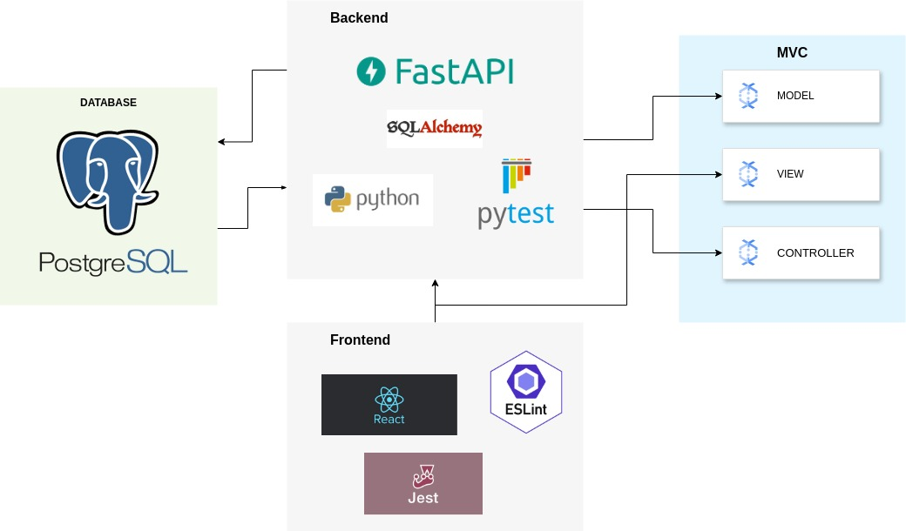
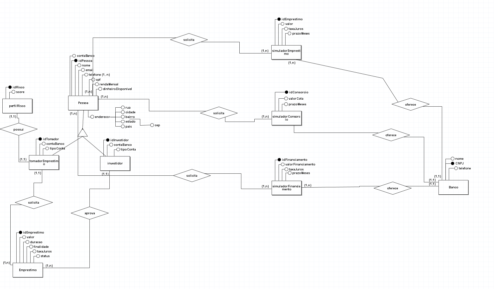

# Arquitetura

## MVC

A arquitetura de projeto a ser empregada por este projeto será o Model-View-Controller (MVC), em que o modelo do banco de dados e as controladoras estão no
Backend, enquanto as visualizações estarão no Frontend. Esta arquitetura foi escolhida pela modularização dos serviços que permite a adaptação do modelo.

## BACKEND

O projeto é orientado a microsserviços, com o backend construído em FastAPI, Python e testes utilizando pytest. O uso do FastAPI proporciona uma rápida e eficiente construção de APIs.

A escolha do pytest para testes se deve à sua flexibilidade e extensibilidade, permitindo a criação de testes unitários, de integração e funcionais de forma organizada e escalável.

A utilização do Docker em todo o backend proporciona uma padronização do ambiente de desenvolvimento, facilitando a replicação do ambiente em diferentes máquinas e garantindo consistência entre os ambientes de desenvolvimento, teste e produção. Além disso, o Docker simplifica o processo de implantação e escalabilidade do sistema.

## FRONTEND

No frontend, a escolha do React como framework de desenvolvimento permite a criação de interfaces de usuário dinâmicas e responsivas, ideais para aplicações web modernas. O uso do Jest para testes e do ESLint para linting contribui para a qualidade do código, garantindo que esteja livre de erros e seguindo boas práticas de codificação.

## BANCO DE DADOS E ORM

Quanto ao banco de dados, a opção pelo PostgreSQL se deve à sua robustez, confiabilidade e suporte a recursos avançados, como transações ACID e suporte a JSON.

A arquitetura desse projeto também inclui o SQLAlchemy para interagir com o banco de dados. SQLAlchemy é um ORM (Object-Relational Mapping) em Python que permite mapear objetos Python para tabelas no banco de dados relacional de forma intuitiva.

## MODELAGEM DO BANCO DE DADOS

### Modelagem Conceitual (Modelagem de Entidade-Relacionamento - MER)

A modelagem do banco de dados para este projeto segue uma abordagem relacional, O modelo conceitual, também conhecido como modelo de Entidade-Relacionamento (ER), é uma etapa fundamental na modelagem de dados, pois captura os principais conceitos e relações do mundo real que serão incorporados ao sistema. A imagem a seguir mostra o MER construído feito no BrModelo.

## SONAR CLOUD

O SonarCloud é uma ferramenta essencial para garantir a qualidade do código em nosso projeto. Utilizando análises estáticas avançadas, o SonarCloud identifica potenciais problemas de código, vulnerabilidades de segurança, bugs e padrões de codificação inconsistentes.

Ao integrar o SonarCloud em nosso fluxo de trabalho, podemos realizar verificações automáticas de código em cada alteração, proporcionando feedback instantâneo aos desenvolvedores. Isso nos ajuda a detectar e corrigir problemas de código precocemente, evitando que se tornem problemas maiores no futuro.
