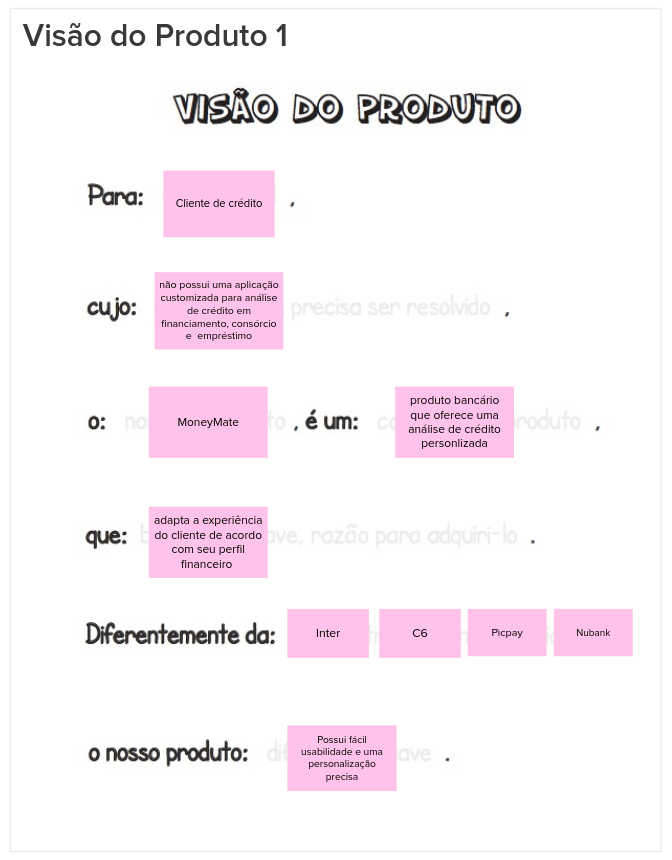
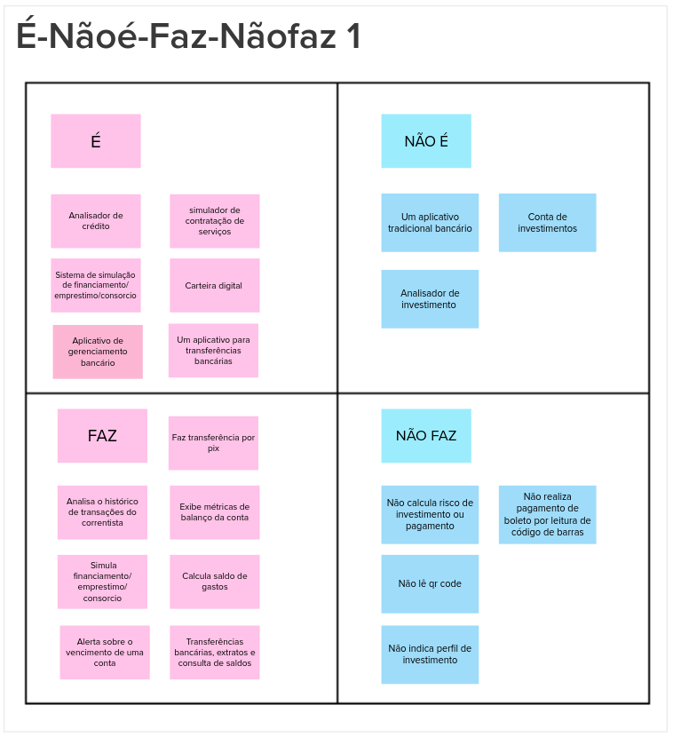
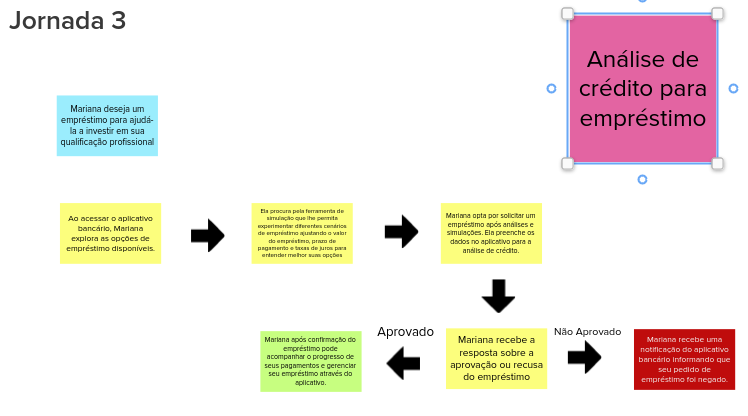
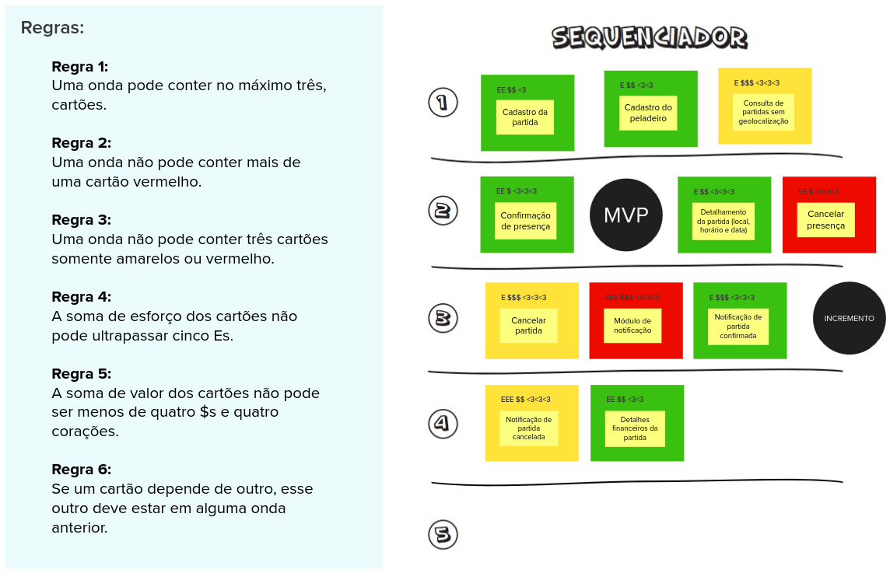
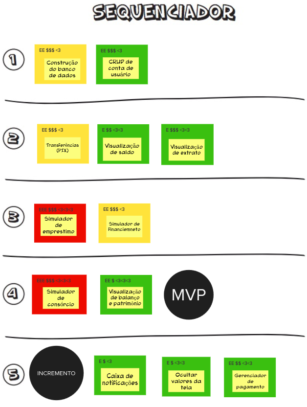

# Lean Inception

## Introdução:
&emsp;&emsp; Lean Inception é a combinação eficaz do Design thinking e do Lean StartUp para decidir o Produto Mínimo Viável (MVP). Sendo um workshop dividido em várias partes e atividades para auxiliar no entendimento e na construção do produto.

&emsp;&emsp; A princípio fizemos as seguintes dinâmicas no nosso Lean Inception:

- Visão do Produto;
- Produto É, NÁO É, FAZ, NÃO FAZ;
- Objetivos do produto;
- Personas;
- Jornada do Usuário
- Brainstorming de funcionalidades;
- Revisão técnica, de negócio e de UX
- Sequenciador;
- Canvas MVP

### Visão do produto

 &emsp;&emsp; No Lean Inception a visão do produto é essencial para definir o valor do negócio e orientar o desenvolvimento inicial. Ela determina quais características do produto serão priorizadas e a estratégia de posicionamento. A visão deve refletir uma mensagem clara e convincente para os clientes, ajudando a traçar o caminho inicial entre a ideia e o lançamento do produto. Esta atividade é colaborativa e ajuda a estabelecer a essência do valor do negócio.

&emsp;&emsp; A partir desse template é importante seguir um passo a passo para cumprir a atividade:

1. Escreva o template visão do produto em um quadro branco ou flip chart, de forma que seja visível para toda a equipe.
2. Divida a equipe em grupos menores e solicite que cada um deles preencha uma lacuna separadamente (ou mais, dependendo do tamanho da equipe).
3. Reúna o resultado de cada grupo, formando uma única frase.

#### Resultado:

### É Não É, Faz Não faz

&emsp;&emsp; Muitas vezes é mais fácil descrever o que alguma coisa não é ou não faz. A atividade "É - Não é - Faz - Não faz" (ENFN) é uma abordagem que busca classificar aspectos positivos e negativos de um produto, descrevendo o que ele é e faz, assim como o que não é e não faz. Esta abordagem visa fornecer uma compreensão clara e abrangente do produto, identificando suas características e limitações. Para executar a atividade basta executar os seguinte passos:

1. Divida um quadro branco ou flip chart em quatro áreas (É / Não é / Faz / Não faz).
2. Escreva o nome do produto em destaque, acima dos quadrantes.
3. Solicite que cada participante descreva o produto, escrevendo as características em post-its e colocando-os nas áreas devidas.
4. Leia e agrupe as notas afins.

#### Resultado:

### Objetivos do produto:

&emsp;&emsp; Cada integrante da equipe é incentivado a expressar sua compreensão dos objetivos do negócio, enquanto diversos pontos de vista são discutidos para alcançar um consenso sobre as prioridades. Esta atividade visa ajudar na identificação e esclarecimento dos objetivos.

&emsp;&emsp; Passo a passo da atividade:

1. Cada membro da equipe é solicitado a escrever individualmente três respostas para a pergunta:  “Se você tiver que resumir o produto em três objetivos para o negócio, quais seriam eles?”.
2. Os participantes compartilham suas respostas em um quadro comum, agrupando-as por similaridade.
3. A equipe colaborativamente reformula os objetivos. Neste momento, torna-se evidente que alguns elementos listados não são objetivos do produto e podem ser descartados. Isso proporciona clareza sobre o foco do projeto para a equipe.

#### Resultado:

### Personas:

&emsp;&emsp; Para compreender efetivamente as funcionalidades de um produto, é crucial considerar os usuários e seus objetivos. Uma abordagem comum para representar os usuários é através de personas. Uma persona retrata um usuário do produto ou serviço, detalhando não apenas seu papel, mas também suas necessidades particulares. Isso proporciona uma representação realista dos usuários, ajudando a equipe a descrever as funcionalidades do produto sob a perspectiva daqueles que interagirão com ele.

&emsp;&emsp; A seguinte atividade é utilizada para descrever os tipos de personas. Tal atividade é simples, ilustrativa, divertida e rápida.

1. Peça ao time que se divida em duplas ou trios e cada um descreva uma persona.
2. Os participantes do grupo devem apresentar suas personas a todo o time.
3. Opcionalmente peça às pessoas que mudem de grupo e que repitam os passos 1 e 2.

#### Resultado:

### Jornadas do Usuário:

#### Resultado:

 

 

 

### Brainstorming de funcionalidades:

#### Resultados:

### Revisão técnica de negocios e de UX:

#### Resultados:

### Sequenciador:

#### Resultados:

### Canvas MVP

#### Resultados:

## Bibliografia

## Histórico de versão
| Data | Versão | Descrição | Autor(es) |
| ---- | ---- | ---- | ---- |
| 03/04/2024 | 1.0 | Criação do Documento | João Henrique |
| 03/04/2024 | 1.1 | Revisão do Documento | Cibele Freitas Goudinho |
| 04/04/2024 | 1.2 | Adicionando Jornadas,brainstorming, revisao técnica e sequenciador | João Henrique |
| 04/04/2024 | 1.3 | Adicionando Textos explicativos em Visão do Produto, É/NÁO É/FAZ/NÃO FAZ, Objetivos do produto e Personas | Paulo Abi Acl |
