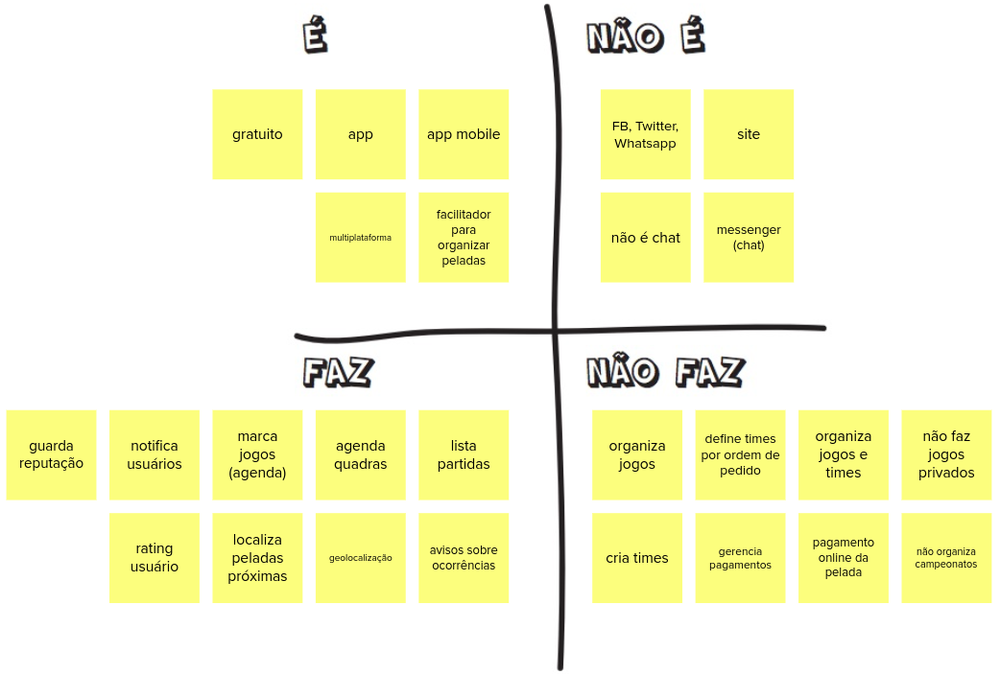
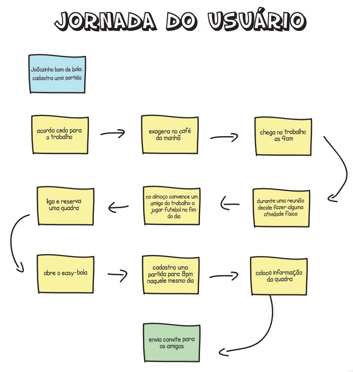
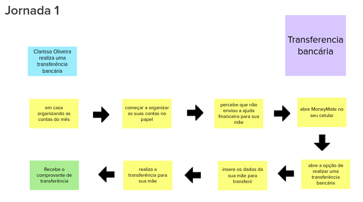
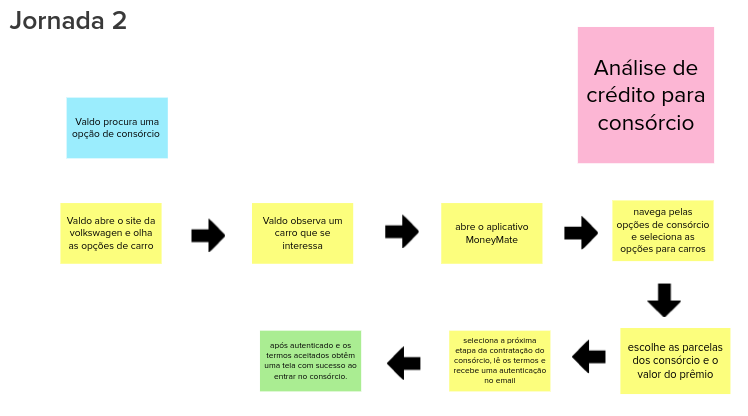
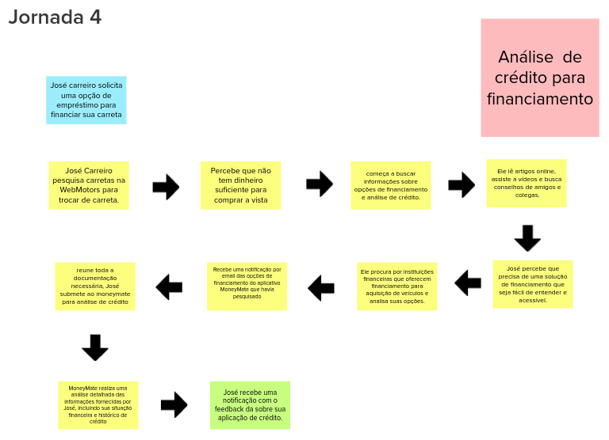
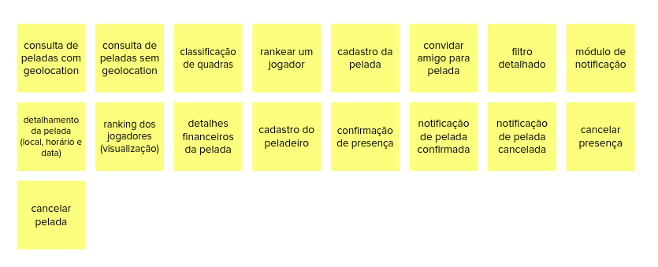
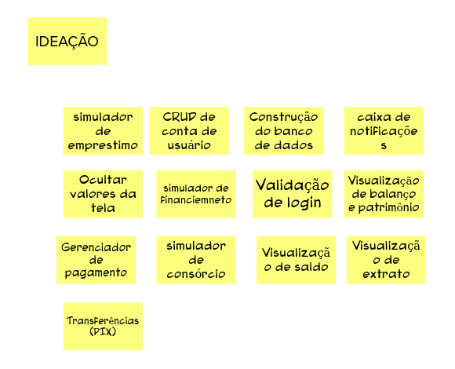
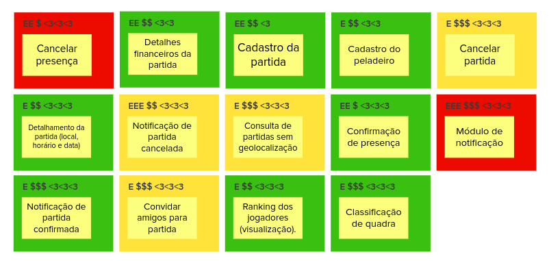
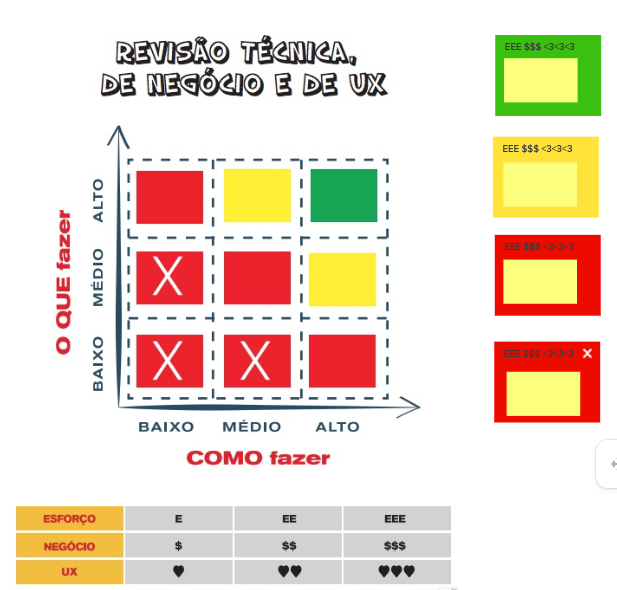

# Lean Inception

## Introdução:
&emsp;&emsp; Lean Inception é a combinação eficaz do Design thinking e do Lean StartUp para decidir o Produto Mínimo Viável (MVP). Sendo um workshop dividido em várias partes e atividades para auxiliar no entendimento e na construção do produto.

&emsp;&emsp; A princípio fizemos as seguintes dinâmicas no nosso Lean Inception:

- Visão do Produto;
- Produto É, NÁO É, FAZ, NÃO FAZ;
- Objetivos do produto;
- Personas;
- Jornada do Usuário
- Brainstorming de funcionalidades;
- Revisão técnica, de negócio e de UX
- Sequenciador;
- Canvas MVP

### Visão do produto

#### Resultado:

### É Não É, Faz Não faz

#### Resultado:

### Objetivos do produto:

#### Resultado:

### Personas:

#### Resultado:

### Jornadas do Usuário:
  A jornada descreve o percurso de um usuário por uma sequência de passos para alcançar um objetivo. Alguns destes passos representam diferentes pontos de contato com o produto, caracterizando a interação da pessoa com ele.

  Para descrever a jornada de usuário:

  1. Divida a equipe em três grupos e solicite que cada um deles descreva UMA jornada.
  2. Cada grupo apresenta a sua jornada para toda a equipe.
  3. Opcionalmente, faça mais rodadas para descrever outras jornadas.

#### Resultados:

 

 

 

### Brainstorming de funcionalidades:
  Uma funcionalidade representa uma ação ou interação de um usuário com o produto, por exemplo: imprimir nota fiscal, consultar extrato detalhado e convidar amigos do Facebook. A descrição de uma funcionalidade deve ser o mais simples possível, visando atender um objetivo de negócio, uma necessidade da persona, e/ou contemplando um passo da jornada.

  Para descrever o brainstorming:
  1. Peça que alguém leia, vagarosamente, o passo a passo de uma jornada de usuário.
  2. Durante a leitura, as pessoas compartilham ideias de funcionalidades.
  3. Quando identificada uma funcionalidade, descreva-a e coloque-a no quadro. Repita os passos anteriores para todas as jornadas.

#### Resultados:

### Revisão técnica de negocios e de UX:
Esta revisão tem o objetivo de discutir como a equipe se sente em relação ao entendimento técnico, o de negócio e o de UX para cada funcionalidade. A partir desta atividade, novas notas serão capturadas e as discordâncias e dúvidas ficarão mais aparentes.

1. Peça para uma pessoa escolher e arrastar uma funcionalidade, passando pelo gráfico e tabela.
2. Defina a cor com o nível de confiança e faça as marcações (em uma escala de 1 a 3) de valor de negócio, esforço e valor de UX -- $, E e ♥.
3. Confirme que todos estão de acordo; escolha a próxima pessoa e retorne ao passo 1.

#### Resultados:

### Sequenciador:
  O Sequenciador de funcionalidades auxilia na organização e visualização das funcionalidades e da sequência de validação incremental do produto.

  1. Peça para as pessoas selecionadas decidirem a primeira funcionalidade.
  2. Busque mais cartões, encaixando-os no sequenciador. Respeite as regras.
  3. Identifique o MVP e os incrementos do produto.

#### Resultados:

### Canvas MVP
  O Canvas MVP é um quadro visual que auxilia a equipe a alinhar e definir a estratégia do MVP, a versão mais simples do produto que pode ser disponibilizada para o negócio (produto mínimo) e que possa ser efetivamente utilizado e validado pelo usuário final (produto viável).

  1. Divida a equipe em dois grupos e solicite que cada grupo preencha o Canvas MVP no seu respectivo template.
  2. Peça para cada grupo apresentar o seu Canvas MVP.
  3. Peça para a equipe consolidar os sete blocos do Canvas MVP, utilizando e alterando as anotações anteriores, conforme necessário.

#### Resultados:

## Bibliografia

> CAROLI, P. Lean Inception. [s.l.] Editora Caroli, 2019.

## Histórico de versão
| Data | Versão | Descrição | Autor(es) |
| ---- | ---- | ---- | ---- |
| 03/04/2024 | 1.0 | Criação do Documento | João Henrique |
| 03/04/2024 | 1.1 | Revisão do Documento | Cibele Goudinho |
| 04/04/2024 | 1.2 | Adicionando Jornadas, Brainstorming, Revisão Técnica e Sequenciador | João Henrique |
| 04/04/2024 | 1.3 | Retificando documentação do artefato | João Durso e Paulo Abi  |

