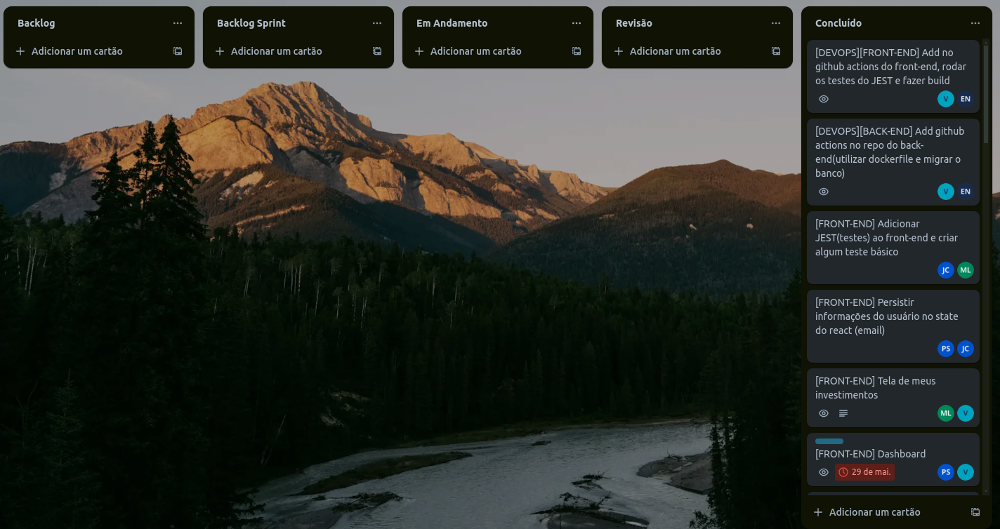

# Planejamento de Desenvolvimento com Scrum Adaptado

Nosso projeto de desenvolvimento de software seguirá uma abordagem ágil, adaptada do Scrum, para garantir uma entrega eficiente e contínua de valor . Com uma equipe dedicada e sprints de duas semanas de duração, nosso objetivo é maximizar a colaboração, a transparência e a adaptação ao longo do processo de desenvolvimento.

# Estratégias de Acompanhamento do Andamento do Desenvolvimento

No nosso projeto de desenvolvimento de software, é crucial adotar estratégias eficazes para acompanhar o andamento do trabalho da equipe, garantindo assim o cumprimento dos prazos e a qualidade do produto final. Abaixo estão algumas estratégias que serão implementadas para esse fim:

## Reuniões Diárias Adaptadas (Daily):

Realizaremos reuniões diárias curtas, conhecidas como daily, via DISCORD por mensagens, onde cada membro da equipe compartilhará o progresso realizado desde a última reunião, os planos para o dia seguinte e quaisquer obstáculos encontrados. Essas mensagens ajudarão a identificar rapidamente quaisquer problemas ou atrasos e a tomar medidas corretivas imediatas.

## Quadro Kanban:

Utilizaremos um quadro Kanban físico ou uma ferramenta online para visualizar o fluxo de trabalho e o status de cada tarefa. O quadro Kanban será dividido em colunas representando os estágios do processo, via trelo, permitindo que todos na equipe acompanhem facilmente o progresso das atividades.

## Estrutura de Sprints:

Cada sprint terá uma duração de duas semanas, começando na segunda-feira e terminando na sexta-feira da segunda semana. Durante esse período, a equipe se concentrará na implementação de funcionalidades específicas, no teste e na iteração contínua do produto.

## Atividades de Cada Sprint:

- **Planejamento da Sprint:** No início de cada sprint, a equipe se reunirá para revisar e priorizar o backlog do produto, selecionando as histórias de usuário a serem implementadas durante o sprint.

- **Desenvolvimento e Implementação:** Durante a primeira semana do sprint, os membros da equipe trabalharão na implementação das funcionalidades definidas no plano da sprint. Eles se comprometerão a entregar um incremento funcional até o final do sprint.

- **Testes e Correções:** Na segunda semana do sprint, a equipe se concentrará na realização de testes de qualidade e na correção de quaisquer problemas identificados. Isso garantirá que o incremento entregue esteja pronto para ser demonstrado .

- **Revisão da Sprint:** Ao final de cada sprint, realizaremos uma revisão para demonstrar as funcionalidades implementadas  e obter feedback. Isso nos permitirá validar o trabalho realizado e ajustar o plano conforme necessário para as próximas iterações.

## Entrega de Releases:

Ao final de cada ciclo de duas sprints, faremos uma entrega de release . Isso permitirá que o cliente avalie e forneça feedback sobre o progresso do projeto, garantindo que estejamos alinhados com suas expectativas e requisitos.

## Iterações e Melhorias Contínuas:

Além das entregas regulares de releases, também dedicaremos tempo para realizar iterações e melhorias contínuas no produto. Isso incluirá a implementação de feedback do cliente, correção de bugs e otimização do desempenho.

Com essa abordagem ágil adaptada do Scrum, estamos confiantes de que seremos capazes de entregar um produto de alta qualidade, atendendo às necessidades e expectativas do cliente de forma eficaz e eficiente.

## Calendário das sprints

| **Sprint**   | **Data de início** | **Data de fim** | **Subgrupo** | **Atividade**                                                            |
| ------------ | ------------------ | --------------- | ------------ | ------------------------------------------------------------------------ |
| **SPRINT 1** | 22/04              | 06/05           | SubGrupo 1   | Reunião de kick-off com a equipe para alinhar objetivos e estratégias.   |
| **SPRINT 1** | 22/04              | 06/05           | SubGrupo 2   | Reunião de kick-off com a equipe para alinhar objetivos e estratégias.   |
| -            | -                  | -               | -            | -                                                                        |
| **SPRINT 2** | 06/05              | 06/05           | SubGrupo 1   | Design detalhado das funcionalidades utilizando o Figma.                 |
| **SPRINT 2** | 06/05              | 20/05           | SubGrupo 2   | Design detalhado das funcionalidades utilizando o Figma.                 |
| -            | -                  | -               | -            | -                                                                        |
| **SPRINT 3** | 20/05              | 03/06           | SubGrupo 1   | Configuração do ambiente de analytics (Sonar).                           |
| **SPRINT 3** | 20/05              | 03/06           | SubGrupo 2   | Configuração do ambiente de desenvolvimento                              |
| -            | -                  | -               | -            | -                                                                        |
| **SPRINT 4** | 03/06              | 17/06           | SubGrupo 1   | Desenvolvimento da lógica do microserviço de CRUD de usuário;            |
| **SPRINT 4** | 03/06              | 17/06           | SubGrupo 2   | Desenvolvimento da lógica do microserviço de CRUD de usuário;            |
| -            | -                  | -               | -            |
| **SPRINT 5** | 17/06              | 17/06           | SubGrupo 1   | Desenvolvimento da lógica do microserviço de simulação de empréstimo;    |
| **SPRINT 5** | 17/06              | 01/07           | SubGrupo 2   | Desenvolvimento da lógica do microserviço de simulação de empréstimo;    |
| -            | -                  | -               | -            | -                                                                        |
| **SPRINT 6** | 01/07              | 08/07           | Subgrupo 1   | Desenvolvimento da lógica do microserviço de simulação de consórcio;     |
| **SPRINT 6** | 01/07              | 08/07           | Subgrupo 2   | Desenvolvimento da lógica do microserviço de simulação de financiamento; |

- Sprint 1 - **Planejamento e Design** :
    - Semana 1:
        - Reunião de kick-off com a equipe para alinhar objetivos e estratégias.

    - Semana 2:
        - Design detalhado das funcionalidades utilizando o Figma.
        - Estabelecimento de prazos e responsabilidades.
        - Configuração do ambiente de analyctis (Sonar).

- Sprint 2,3 e 4 - **Desenvolvimento dos Microsserviços** :
    - Semana  3/4:
        - Desenvolvimento da lógica do microserviço de CRUD de usuário;
        - Desenvolvimento da lógica do microserviço de simulação de empréstimo;
        - Testes unitários e de integração;

    - Semana  5/6:
        - Desenvolvimento da lógica do microserviço de simulação de financiamento;
        - Desenvolvimento da lógica do microserviço de simulação de consórcio;
        - Testes unitários e de integração;

    - Semana  7/8:
        - Integração com o microserviço de chatbot;
        - Integração com o microserviço de marketing;
        - Testes unitários e de integração;

- Sprint 5 e 6 - **Integração e Testes da Plataforma**
    - Semana 9/10:
        - Testes finais de usabilidade e aceitação do usuário;
    - Semana 11:
        - Deploy da aplicação;
        - Finalização da documentação; 
        - Disponibilização do APP;

## Histórico de versão

| Data | Versão | Descrição | Autor(es) |
| ---- | ------ | --------- | --------- |
| 16/04/2024 | 0.1.0 | Criação do documento | Victor |
